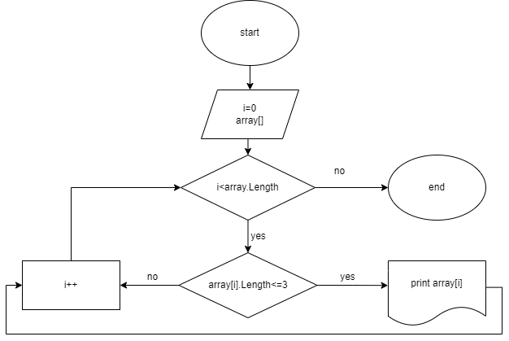

# Задание
Написать программу, которая из имеющегося массива формирует массив из строк, длина которых меньше либо равна 3 символа. Первоначальный массив можно ввести с клавиатуры, либо задать на старте выполнения алгоритма. При решении пользоваться массивами.

1. Создать репозиторий.
2. Нарисовать блок-схему алгоритма.
3. Снабдить репозиторий текстовым описанием решения.
4. Написать программу, решающую поставленную задачу.
5. Использовать контроль версий.

